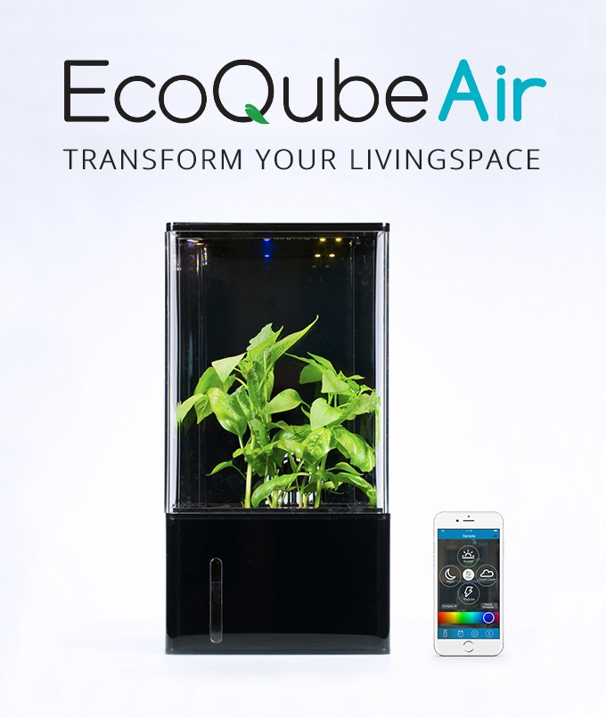
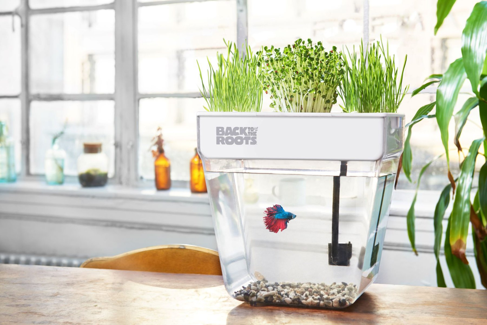
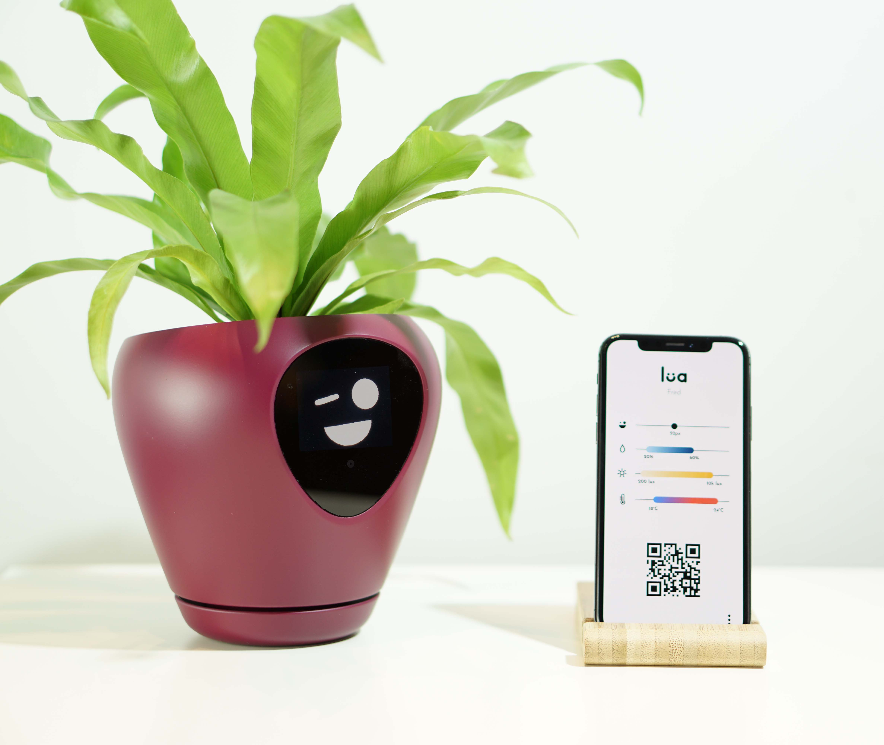
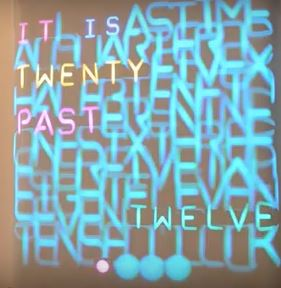
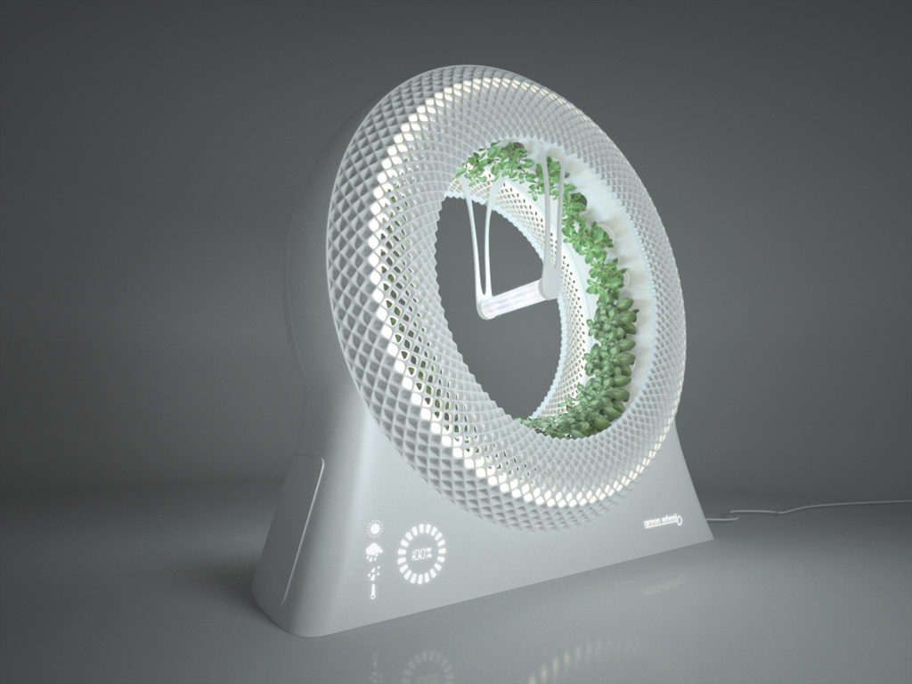
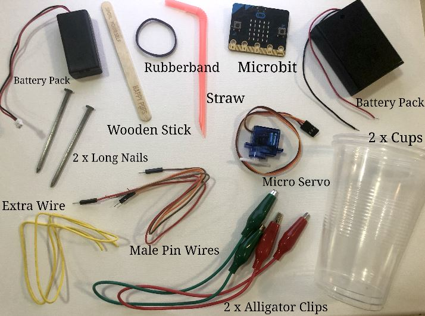

# Assessment 1: Replication project

*Markdown reference:* [https://guides.github.com/features/mastering-markdown/](http://guides.github.com/features/mastering-markdown/)

## Automatic Plant Waterer ##
(Insert the name of the project you chose to replicate.)
I have chosen to replicate the automatic plant waterer. This is because I enjoyed the previous work example of the plant waterer and wanted to learn the mechanisms of this project but I knew I would not pursue something similar in my final project.

## Related projects ##
*Find about 6 related projects to the project you choose. A project might be related through  function, technology, materials, fabrication, concept, or code. Don't forget to place an image of the related project in the* `replicationproject` *folder and insert the filename in the appropriate places below. Copy the markdown block of code below for each project you are showing, updating the number* `1` *in the subtitle for each.*

### Related project 1- EcoQube Air ###

(https://www.kickstarter.com/projects/kevinzl/ecoqube-air-the-coolest-desktop-greenhouse-ever)

(This is an image of the EcoQube Air, a desktop greenhouse.)

This is a desktop greenhouse aimed to improve air quality and provide smart light therapy. The components of this project include an induction water pump that quietly flows water, air filter that removes harmful air particles and encourages healthy plant growth, dual fans that purify 450 feet of air every hour, customisable LEDs, and a connectable mobile app. Providing the perfect environment environment for plants, this project both helps you to grow plants easier but also improves your own quality of life. 

This project is related to my chosen replication project because it caters to the specific needs of the plant and automatically fufills them. They are also related as they both automatically water plants and help us take care of plants. However, this specific product is marketed to improve our lives by combining an air purifer and desktop plant, rather than just to help us to care for nature.

### Related project 2- The Water Garden by BackToTheRoots ###

(https://backtotheroots.com/products/watergarden)

(The Water Garden automatically cares for both plants but also fish.)

The Water Garden is an aquaponics fish tank that both cleans itself and grows plants. The fish's waste fertilises the plants while the plants purify the water. The water garden is a closed-loop aquaponics system. The water from the fish tank is pumped into the plants, where beneficial bacteria growing on the plant's roots convert the ammonia within the fish waste into nitrates that fertilises the plants and cleans the tank.
This project has some major similarities to my project as it automatically cares for the plants without human assistance. This project is much more advanced as it automatically cares for both the needs of nature and living species. It also helps us care for plants and makes it so much easier to do so by increasing the work we have to do to keep plants alive and healthy. I found this project very interesting due to the science behind the fertilisation and the purification of the water through different types of bacteria.

### Related project 3- Automatic Bubble Blower ###

(https://www.instructables.com/id/Bubblesteen-Bubble-Machine/)
(https://www.superhouse.tv/diy-bubble-machine/)

(Above is an image of an automatic bubble blower, that takes the work out of blowing bubbles.)

This project is an automatic bubble blower which is built with micro servos and other various materials. It is comprised of a micro-controller platform, an arm that holds the bubble wand, a vessel forr the bubble liquid and a fan the blows the bubble. The servo gives the bubble wand both tilting and paning capabilities so the angle of the bubble wand can be adjusted to collect bubble liquid and mve in front of the fan. 

This project is related to mine because it uses the same technological mechanical equipment of a micro servo. The tutorial of this project has expanded my knowledge of micro servos and different ways I can utilise them in interactive projects. I was interested in this project as it combines the use of a motorised pan and a micro servo.

### Related project 4- Lua Virtual Pet Plant Pot ###

(https://mu-design.lu/lua#presskit-lua)

(The Lua visually indicates the plant's needs, thus taking the guess work out of caring for plants and making it much easier.)

The Lua Virtual Pet Plant Pot is pant pot that turns any plant into a virtual pet that visually indicates it's needs. WHen connected to an app, the Lua has six essential animations; thirsty: when the plant is dehydrated, sick: when the plant is over-hydrated, vampire: if the plant is not exposed to sufficient light for a certain amount of time, squint: the plant has been exposed to too much sunlight, cold: when the temperature drops and hot: when the temperature is too high. It also has random animations and 'happy' animations to indicate that it is healthy. This virtual pet also has motion tracking and will follow moving objects with it's eyes. Installed with a sub-irrigation water reservoir and foursensors; moisture sensor, light level sensor, motion sensor and temperature sensor, this pot detects and fufills all of the plant's needs automatically. 
This project is related to my self watering plant waterer because it also waters plants and detects the needs of plants. This pot also is centered around making it easier for us to care for plants. But this expands on my basic idea by catering to all of the plant's needs, adding fun animations, and developing the plant as it's own living entity by detecting and communicating it's own specific needs, thus making it both easier but more fun to look after plants.

### Related project 5- Word Clock ###

(https://create.arduino.cc/projecthub/mvonsivers/servo-controlled-word-clock-51696b?ref=tag&ref_id=servo&offset=76)

(This is an image of the word clock that uses servo motors to visually indicate the time.)

The word clock is a large visual clock that represents the time visually through words. This display clock is constructed of 114 servo motors, 300 LEDs, some custom 3D printed or laser cut parts, linear actuators and various other materials. The 114 letters are made from a 3D printed box with installed LEDs and the servo motors raise or push foward the appropriate letters which correlate with the according LEDs. It is also covered with semi-transparent foil that hides all of the components but still allows the letters to be seen through the LEDS but also not be seen when the servo motors compress the letters to the frame, thus creating the appearing effect to the letters. I was interested in this project as it uses servo motors in a large scale display thus expanding my knowledge of how servo motors can be used in much more complex projects.
The word clock is similar to my chosen replication project as it uses many servos motors and thus utilises the same technology and foundation mechanical equipment. However, this project has a completely different function, construction and purpose. These projects are also connected as they both aim to make our lives easier. 

### Related project 6- The Green Wheel by DesignLibero ###

(https://www.designlibero.com/portfolio/the-green-wheel/)

(The Green Wheel is a circular automatic garden that rotates around a focal light source.)

Based on NASA's rotary hydroponic garden that provides astronauts with fresh produce whilst in orbit, The Green Wheel creates an optimal enviroment for house plants. Its circular design provides more space for plants and caters to the plant's light needs as it is arranged around a centre light source and the plants rotate around it. A water reservoir and a pump automatically waters the plants when needed. 

This project is similar to my chosen replication project as it also detects and fufills the needs of the plant. This project is much more advanced as it fufills all of the plants needs such as watering and sunlight rather than just watering. I was interested in this specific product as I enjoyed the rotating mechanisma nd the purpose of this.

## Reading reflections ##
*Reflective reading is an important part of actually making your reading worthwhile. Don't just read the words to understand what they say: read to see how the ideas in the text fit with and potentially change your existing knowledge and maybe even conceptual frameworks. We assume you can basically figure out what the readings mean, but the more important process is to understand how that changes what you think, particularly in the context of your project.*

*For each of the assigned readings, answer the questions below.*

### Reading: Don Norman, The Design of Everyday Things, Chapter 1 (The Psychopathology of Everyday Things) ###

*What I thought before: Describe something that you thought or believed before you read the source that was challenged by the reading.*

*What I learned: Describe what you now know or believe as a result of the reading. Don't just describe the reading: write about what changed in YOUR knowledge.*

*What I would like to know more about: Describe or write a question about something that you would be interested in knowing more about.*

*How this relates to the project I am working on: Describe the connection between the ideas in the reading and one of your current projects or how ideas in the reading could be used to improve your project.*

### Reading: Chapter 1 of Dan Saffer, Microinteractions: Designing with Details, Chapter 1 ###

*What I thought before: Describe something that you thought or believed before you read the source that was challenged by the reading.*

*What I learned: Describe what you now know or believe as a result of the reading. Don't just describe the reading: write about what changed in YOUR knowledge.*

*What I would like to know more about: Describe or write a question about something that you would be interested in knowing more about.*

*How this relates to the project I am working on: Describe the connection between the ideas in the reading and one of your current projects or how ideas in the reading could be used to improve your project.*

### Reading: Scott Sullivan, Prototyping Interactive Objects ###

*What I thought before: Describe something that you thought or believed before you read the source that was challenged by the reading.*

*What I learned: Describe what you now know or believe as a result of the reading. Don't just describe the reading: write about what changed in YOUR knowledge.*

*What I would like to know more about: Describe or write a question about something that you would be interested in knowing more about.*

*How this relates to the project I am working on: Describe the connection between the ideas in the reading and one of your current projects or how ideas in the reading could be used to improve your project.*

## Interaction flowchart ##
*Draw a flowchart of the interaction process in your project. Make sure you think about all the stages of interaction step-by-step. Also make sure that you consider actions a user might take that aren't what you intend in an ideal use case. Insert an image of it below. It might just be a photo of a hand-drawn sketch, not a carefully drawn digital diagram. It just needs to be legible.*
###  Basic Interaction Flowchart ###

(This is an image of the basic interaction flowchart.)

### Final Interaction Flowchart ###

(This is an image of a more complicated final interaction flowchart.)

The first interaction flowchart is a basic version that depicts the basic functions of my project. However, the second final interaction flowchart shows all of the capabilities of my project, thus showing a more detailed illustration of the full interactions. 

# Process documentation

## Initial Planning ##
### Diagram of Basic Wiring and Construction ###

(This is a hand-drawn diagram that visually depicts the wiring and construction of the basic replication project.)

This diagram was the first step in planning my replication project. Based on the wiring from the tutorial, this is not the final construction I used in my project. Whilst actually building the project I had to problem solve and make some slight adaptions. Instead of using double-sided alligator clips and male pin to alligator clips, I used stripped wires wrapped around nuts and bolts conected to the microbit. This is because the alligator clips did not create a strong enough connection and this connection were too precarious, thus decreasing the reliability of the connections and the project as a whole. Below is the final diagram for the basic wiring and intial construction.

(Above is an image of a hand-drawn diagram of the final wiring and basic construction I used in my final project that was subject to minor alterations due to problem solving during construction.)

This is the final wiring and construction of the project. During the construction process, I encountered a few obstacles where I had to adapt the wiring, thus explaining the different diagram iterations. 

### Final Fabrication Diagram ###

(This is an image of a hand-drawn diagram of the way in which I planned to fabricate this project.)

I have chosen to fabricate my project inside a cardboard box. Two holes are cut in the lid for the cups to sit in. Inside the box, the cups are secured in a cardboard cup holder. I also created a window so that the battery packs can be accessed without opening the whole box. I cut a window for the microbit to be inserted into so that the buttons and screen can be seen from the outside. The purpose of this final fabrication was to streamline my project and neatly hide the messy wires and battery packs. 

### Material List ###

(This is my initial list of materials.)

I created this material list based on the materials listed in the tutorial. However, I slightly altered some materials when actually constructing my project. Below is an image of the materials I actually used in constructing the basic wiring and construction.

### Materials ###

(Above is a labelled diagram of the materials I actually used in creating the basic wiring and construction of the project.)

These are the materials I actually used when creating my project. I used a variety of both household materials and electrical parts to create my project. I chose these specific materials as they were easily accessible and cheap. I adapted the material list from the tutorial to fit my circumstances such as access to materials and tools, and convenience in coding and constructing my project. I also chose not to solder the connections as this is just a prototype replication not a final product. 

### Code ###
(https://makecode.microbit.org/_A8m46CdK1Vpu)

### Construction ###
## Basic Construction ##
# Prototype Function Test #
## Final Fabrication ##
*In this section, include text and images that represent the development of your project including sources you've found (URLs and written references), choices you've made, sketches you've done, iterations completed, materials you've investigated, and code samples. Use the markdown reference for help in formatting the material.*

*This should have quite a lot of information!*

*There will likely by a dozen or so images of the project under construction. The images should help explain why you've made the choices you've made as well as what you have done. Use the code below to include images, and copy it for each image, updating the information for each.*

*Include screenshots of the code you have used.*

## Project outcome ##

*Complete the following information.*

### Project title ###

### Project description ###

*In a few sentences, describe what the project is and does, who it is for, and a typical use case.*

### Showcase image ###

*Try to capture the image as if it were in a portfolio, sales material, or project proposal. The project isn't likely to be something that finished, but practice making images that capture the project in that style.*

### Additional view ###

*Provide some other image that gives a viewer a different perspective on the project such as more about how it functions, the project in use, or something else.*

### Reflection ###

*Describe the parts of your project you felt were most successful and the parts that could have done with improvement, whether in terms of outcome, process, or understanding.*

*What techniques, approaches, skills, or information did you find useful from other sources (such as the related projects you identified earlier)?*

*What ideas have you read, heard, or seen that informed your thinking on this project? (Provide references.)*

*What might be an interesting extension of this project? In what other contexts might this project be used?*

### Limitations ###

### Strengths ###
