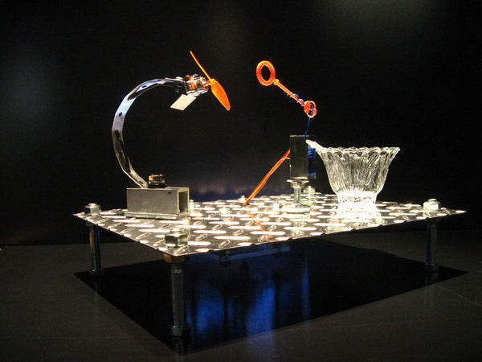

# Assessment 1: Replication project

*Markdown reference:* [https://guides.github.com/features/mastering-markdown/](http://guides.github.com/features/mastering-markdown/)

## Automatic Plant Waterer ##

I have chosen to replicate the automatic plant waterer. This is because I enjoyed the previous work example of the plant waterer and wanted to learn the mechanisms of this project but I knew I would not pursue something similar in my final project. I also chose this project as I have many house plants and thought this product could be useful as it related to me personally.

## Related projects ##

### Related project 1- EcoQube Air ###

(https://www.kickstarter.com/projects/kevinzl/ecoqube-air-the-coolest-desktop-greenhouse-ever)

(This is an image of the EcoQube Air, a desktop greenhouse.)

This is a desktop greenhouse aimed to improve air quality and provide smart light therapy. The components of this project include an induction water pump that quietly flows water, air filter that removes harmful air particles and encourages healthy plant growth, dual fans that purify 450 feet of air every hour, customisable LEDs, and a connectable mobile app. Providing the perfect environment for plants, this project both helps you to grow plants easier but also improves your own quality of life. 

This project is related to my chosen replication project because it caters to the specific needs of the plant and automatically fufills them. They are also related as they both automatically water plants and help us take care of plants. However, this specific product is marketed to improve our lives by combining an air purifer and desktop plant, rather than just to help us to care for nature.

### Related project 2- The Water Garden by BackToTheRoots ###

(https://backtotheroots.com/products/watergarden)

(The Water Garden automatically cares for both plants but also fish.)

The Water Garden is an aquaponics fish tank that both cleans itself and grows plants. The fish's waste fertilises the plants while the plants purify the water. The water garden is a closed-loop aquaponics system. The water from the fish tank is pumped into the plants, where beneficial bacteria growing on the plant's roots convert the ammonia within the fish waste into nitrates that fertilises the plants and cleans the tank.

This project has some major similarities to my project as it automatically cares for the plants without human assistance. This project is much more advanced as it automatically cares for both the needs of nature and living species. It also helps us care for plants and makes it so much easier to do so by decreasing the work we have to do to keep plants alive and healthy. I found this project very interesting due to the science behind the fertilisation and the purification of the water through different types of bacteria.

### Related project 3- Automatic Bubble Blower ###

(https://www.instructables.com/id/Bubblesteen-Bubble-Machine/)
(https://www.superhouse.tv/diy-bubble-machine/)

(Above is an image of an automatic bubble blower, that takes the work out of blowing bubbles.)

This project is an automatic bubble blower which is built with micro servos and other various materials. It is comprised of a micro-controller platform, an arm that holds the bubble wand, a vessel for the bubble liquid and a fan the blows the bubble. The servo gives the bubble wand both tilting and paning capabilities so the angle of the bubble wand can be adjusted to collect bubble liquid and move in front of the fan. 

This project is related to mine because it uses the same technological mechanical equipment of a micro servo. The tutorial of this project has expanded my knowledge of micro servos and different ways I can utilise them in interactive projects. I was interested in this project as it combines the use of a motorised pan and a micro servo.

### Related project 4- Lua Virtual Pet Plant Pot ###

(https://mu-design.lu/lua#presskit-lua)

(The Lua visually indicates the plant's needs, thus taking the guess work out of caring for plants and making it much easier.)

The Lua Virtual Pet Plant Pot is pant pot that turns any plant into a virtual pet that visually indicates its needs. When connected to an app, the Lua has six essential animations; thirsty: when the plant is dehydrated, sick: when the plant is over-hydrated, vampire: if the plant is not exposed to sufficient light for a certain amount of time, squint: the plant has been exposed to too much sunlight, cold: when the temperature drops and hot: when the temperature is too high. It also has random animations and 'happy' animations to indicate that it is healthy. This virtual pet also has motion tracking and will follow moving objects with it's eyes. Installed with a sub-irrigation water reservoir and foursensors: moisture sensor, light level sensor, motion sensor and temperature sensor, this pot detects and fufills all of the plant's needs automatically. 
This project is related to my self watering plant waterer because it also waters plants and detects the needs of plants. This pot also is centered around making it easier for us to care for plants. But this expands on my basic idea by catering to all of the plant's needs, adding fun animations, and developing the plant as its own living entity by detecting and communicating it's own specific needs. This consequently makes it both easier and more fun to look after plants. This project is also related through technology as it uses specific sensors to detect the plant's needs, and my project uses a moisture sensor to detect the plant's hydration.

### Related project 5- Word Clock ###

(https://create.arduino.cc/projecthub/mvonsivers/servo-controlled-word-clock-51696b?ref=tag&ref_id=servo&offset=76)

(This is an image of the word clock that uses servo motors to visually indicate the time.)

The word clock is a large visual clock that represents the time visually through words. This display clock is constructed of 114 servo motors, 300 LEDs, some custom 3D printed or laser cut parts, linear actuators and various other materials. The 114 letters are made from a 3D printed box with installed LEDs and the servo motors raise or push foward the appropriate letters which correlate with the according LEDs. It is also covered with semi-transparent foil that hides all of the components but still allows the letters to be seen due to the the LEDS. The foil screen also allows each of the letters to disappear and reappear as the servo motors compress and decompress the letters. I was interested in this project as it uses servo motors in a large scale display thus expanding my knowledge of how servo motors can be used in much more complex projects.

The word clock is similar to my chosen replication project as it uses many servos motors and thus utilises the same technology and foundation mechanical equipment. However, this project has a completely different function, construction and purpose. These projects are also connected as they both aim to make our lives easier. 

### Related project 6- The Green Wheel by DesignLibero ###

(https://www.designlibero.com/portfolio/the-green-wheel/)

(The Green Wheel is a circular automatic garden that rotates around a focal light source.)

Based on NASA's rotary hydroponic garden that provides astronauts with fresh produce whilst in orbit, The Green Wheel creates an optimal enviroment for house plants. Its circular design provides more space for plants and caters to the plant's light needs as it is arranged around a centre light source and the plants rotate around it. A water reservoir and a pump automatically waters the plants when needed. 

This project is similar to my chosen replication project as it also detects and fufills the needs of the plant. This project is much more advanced as it fufills all of the plants needs such as watering and sunlight rather than just watering. This project is also related to my chosen project as it also helps us care for plants thus making our lives easier. I was interested in this specific product as I enjoyed the rotating mechanism and the purpose of this technology.

## Reading reflections ##

### Reading: Don Norman, The Design of Everyday Things, Chapter 1 (The Psychopathology of Everyday Things) ###
Before reading this text I did not understand the extent or complexity of design. I now know of the well thought out process that designers go through to achieve a successful product. I previously thought that design was centered around the final outcome of a product but this reading taught me that it is more about the experience you create with your product. The way the you make your audience feel, either positive or negative, is the most memorable element of engaging with a product. As "when our home technology behaves in an uninterpretable fashion we can become confused, frustrated and even angry"(p.1) and "when there is understanding it can lead to a feeling of control, of mastery, and of satisfaction"(p. 1), designers must consider how emotion and cognition will develop the experience of their product and thus effect their product's performance.

Through engaging with this text I learnt the fundamental principles of interaction: affordances, signifiers, constraints, mappings, feedback and the conceptual model, thus advancing my conceptual frameworks of interactive design. I also learnt that the experience created by the product is the most important aspect as it is the most memorable facet, both in negative and positive ways. I was also introduced to the true science of good design; as "people need some way of understanding the product or service they wish to use"(p.2) and "for designers [affordance's] visibilty is critical: visible affordances provide strong clues to the operations of things"(p.2). I did not understand the depth of the design process and all of the small decisions that can make or break the final product. I now know of the thorough planning that the design process should include and how designers should not just focus on the final product but every single small element that makes up the big picture.

I would like to find out more about the author of this text and his background in design. Did he coin these terms or are they already widely known in the design/maker community? I would also like to know more about why "Engineers tend not to like [the word experience], as it is too subjective"(p. 1). Why specificaly engineers? What does he mean by 'subjective'? I would also like to learn about real life examples of the fundamental principles of design from other designers or creators. How are the fundamental pinciples of design utilised in varying contexts across the design community?

The concepts expressed in this text relates to my specific project as I tried not to concentrate so much on the larger picture or final outcome but rather I attempted to master each small component and the fundamental principles of interaction so they all worked together smoothly. This is evident through the small details that I added for convenience, such as the pull window for the battery packs and the window for the microbit. I also included the fundamental principles of interaction. Affordances are prominent through the ribbon on the pull window that encourages the audience to open the window and the window for the microbit provides access to the buttons. These aspects are also signifiers as they signify where to open the battery packs and where to check the moisture reading. Feedback is evident through the umbrella icon that is generated when the plant is about to be automatically watered, and the bar graph that is created when the moisture level is sufficient. These are also conceptual models as the umbrella icon visually indicates that it will water the plant and the bar graph visually indicates that the plant does not need to be watered as the moisture content is already high. However, the buttons do not have any conceptual models to indicate their purpose. If I were to improve this project I would include a conceptual model so that the audience knows that to recieve the numerical moisture reading they need to press and hold button A. Overall, the concepts conveyed in this text framed my understanding of the fundamental principles of interaction, thus allowing me to apply this knowledge both in this project but also when reflecting on how to improve my replication project.

### Reading: Chapter 1 of Dan Saffer, Microinteractions: Designing with Details, Chapter 1 ###

Before reading this text, I believed that the small aspects were not as important as the larger picture. I often overlooked and did not pay equal attention to the small functionality components and mainly focused on the project as whole.  This reading challenged this view as it explained how clumbsy and frustrating microinteractions can compromise a whole project no matter how good the concept or design may be. After reading this text my knowledge of electrical interaction language and microinteractions was expanded and my previous view was challenged thus changing my perspective as a designer. I now believe that all parts of functionality, no matter how small, should be treated equally and to the highest standard.

When reading this chapter I learned what a microinteraction is and the functions, importance and structure of them. A microinteraction is a functional detail of a product that is one piece of functionality and only completes one thing. Building onto this idea, I learnt the importance of these overlooked elements as these small functions can ruin the whole project. Even if the main features are created beautifully, the microinteractions need to also be executed in the same manner in order to avoid mass amounts of frustration. I really enjoyed the following quote as it simplifies this concept and truly elucidates the importance of microinteractions: "The design of your product is only as good as its smallest part"(p. 6). I also learnt the importance of microinteractions in the design industry as designers have to change their mindset to create a well-rounded functional product. This is because microinteractions force designers to focus on the details rather than the larger picture and work in simple terms. Microinteractions encourage designers to simplify their design and streamline complex features. I also enjoyed learning about the history of microinteractions and how electricity advanced microinteractions so much so that "action became abstracted"(p. 12) as we do not even have to be in the same room to trigger a microinteraction. I also learnt the language related to microinteractions and their structure: trigger, rules, feedback and loops or modes. Overall, I learnt alot and enjoyed engaging with this text. 

I would like to learn more about microinteractions as a philosphy and the methods of approaching microinteractions. What is the most popular method when dealing with microinteractions? Are these methods widely known within the designer community? Are there other less common methods to approach microinteractions? If "in competitive markets microinteractions are even more important"(p. 7) and "microinteractions are the glue that can tie together features"(p.7), do large companies really spend as much time on these tiny pieces of functionality as this text encourages? 

The content of this reading relates to my personal replication project as if the small functions such as the bar graph and display of the moisture reading did not function correctly, the whole project would be compromised. It is not just about the main purpose of watering the plant, all of the features should work and have equal attention paid to them in order to create a well-rounded project. Consequently, when constucting and coding my project I paid great attention to the small details and the larger picture, to make sure all pieces of functionality were all working and I was not just focusing on the main components. Thus, this reading helped me in the design process to improve the small functionality of the minor details. This is evident as I added a small window to access the battery pack and the microbit screen which increases convenience and makes sure all components, even the minute ones, are accessible and working as intended. I also utilised the structure of microinteractions that is conveyed in this reading. There a few triggers in my project. The first is when the user inserts the nails to measure the moisture or switches on the battery pack. Others include when the button is pressed to generate a reading. The rules of these microinteractions are that if the moisture reading is less than 500 the plant waterer waters the plant and if the moisture reading is more than 500 the plant waterer does not water the plant but instead begins the cycle of testing the moisture again. The umbrella icon and the bar graph is feedback as it indicates whether the plant will be watered or not. The display of the moisture reading when button A is pressed and the microbit turning on when the battery pack is switched on is also feedback. Loops and modes are evident through the continuous loop of moisture testing so that the plant is also being watered. Using microinteractions as a philosphy I took on the method of approaching the product as a set of microinteractions. Rather than dealing with this project in a larger picture I tried to work on each micrinteraction equally.

### Reading: Scott Sullivan, Prototyping Interactive Objects ###

Before engaging with this text, I believed that the design process was moderately important and creating prototypes is useful. However, this reading challenged my belief by teaching me the immense importance of the design process and the creation of multiple prototypes in order to reach the best possible iteration. Although frustrating, setbacks are important to develop problem solving skills and make the best possible final product. It also taught me the importance of flexibility in the design process.

By reading this text I learnt real life examples that utilise interactive technology. It also expanded my knowledge of the language surrounding interactive projects and this industry. I now know that a designer makes nontechnical decisions surrounding the functionality and structure. However, a developer implements these decisions to create the product. This relationship is changed due to emerging technology, thus making designers more adaptive and learning to code more important than ever in this competitive market. I also learnt of the transformative nature that designers have to develop, as they now have to "be able to create prototypes and interpret the data that our prototypes produce"(p. 227). Through the real life case studies, I learnt about the adaptations that have to be made due to problem solving in the design process and how to tackle these hurdles during this process. I had some knowledge of the importance of problem solving during the design process, but this text opened my eyes to the immense flexibilty designers have to develop when encountering setbacks.

Although this text did provide ample information and many real life examples that greatly expanded my knowledge of prototyping and the design process I would like to know more about whether systems such as Arduino and Microbit are used in prrofessional settings? Are they just used for prototyping? Are they widely known in the design industry? 

The concept of prototyping and the designer's role relates to my chosen replication project as I had to be both the designer and developer. I took on all roles, I designed, developed, coded, constructed, showcased and marketted my project. I had to take on the ideologies of the adaptive role of the designer from this text when completing my own project as I needed to think through many different perspectives and learn many new skills. During the construction process I also had to create a few different prototypes seen through both my diagram iterations, material list changes, and the problem solving I had to do when completing the basic wiring. The ideas represented in this reading allowed me to improve my project by easily overcoming the problems I encountered as I understood my adaptive role and the importance of planning and prototyping.

## Interaction flowchart ##

###  Basic Interaction Flowchart ###

(This is an image of the basic interaction flowchart.)

### Final Interaction Flowchart ###

(This is an image of a more complicated final interaction flowchart.)

The first interaction flowchart is a basic version that depicts the basic functions of my project. However, the second final interaction flowchart shows all of the capabilities of my project, thus showing a more detailed illustration of the full interactions. 

# Process documentation

## Initial Planning ##
### Diagram of Basic Wiring and Construction ###

(This is a hand-drawn diagram that visually depicts the wiring and construction of the basic replication project.)

This diagram was the first step in planning my replication project. Based on the wiring from the tutorial, this is not the final construction I used in my project. Whilst actually building the project I had to problem solve and make some slight adaptions. Instead of using double-sided alligator clips and male pin to alligator clips, I used stripped wires wrapped around nuts and bolts conected to the microbit. This is because the alligator clips did not create a strong enough connection and this connection were too precarious, thus decreasing the reliability of the connections and the project as a whole. Below is the final diagram for the basic wiring and intial construction.

(Above is an image of a hand-drawn diagram of the final wiring and basic construction I used in my final project that was subject to minor alterations due to problem solving during construction.)

This is the final wiring and construction of the project. During the construction process, I encountered a few obstacles where I had to adapt the wiring, thus explaining the different diagram iterations. 

### Final Fabrication Diagram ###

(This is an image of a hand-drawn diagram of the way in which I planned to fabricate this project.)

I have chosen to fabricate my project inside a cardboard box. Two holes are cut in the lid for the cups to sit in. Inside the box, the cups are secured in a cardboard cup holder. I also created a window so that the battery packs can be accessed without opening the whole box. I cut a window for the microbit to be inserted into so that the buttons and screen can be seen from the outside. The purpose of this final fabrication was to streamline my project and neatly hide the messy wires and battery packs. 

### Material List ###

(This is my initial list of materials.)

I created this material list based on the materials listed in the tutorial. However, I slightly altered some materials when actually constructing my project. Below is an image of the materials I actually used in constructing the basic wiring and construction.

### Materials ###

(Above is a labelled diagram of the materials I actually used in in this replication project.)

These are the materials I actually used when creating my project. I used a variety of both household materials and electrical parts to create my project. I chose these specific materials as they were easily accessible and cheap. I adapted the material list from the tutorial to fit my circumstances such as access to materials and tools, and convenience in coding and constructing my project. I attempted to use the alligator clips but the connections were not strong enough so I substituted them for the extra wire and wrapped the wire around to create loops that were connected to nuts and bolts on the microbit. I also chose not to solder the connections as this is just a prototype replication not a final product. 

### Code ###
(https://makecode.microbit.org/_A8m46CdK1Vpu)

After planning my project on paper, the first step I took in actually creating my project was the coding process. I wanted to start the coding process first so I could understand the base functions of my project before actually constructing it. My code pretty much remained the same throughout the construction of my project. I did alter some of the servo pin inputs when the servo was not working but then I realised a wire was on the incorrect pin, and the code was correct. Consequently, I had to go back and change the code to the original iteration. Other than that, the code operated correctly and performed all of the required functions such as adjusting the sero motor when the reading is less than 500, reading the electrical resistance, showing a bar graph of this reading, providing this reading on screen when button A is pressed, showing an umbrella icon when the reading is less than 500 and lowering the brightness of the microbit to conserve power.

#### Block Code ####

(This is a screenshot of the microbit make code block code for this project.)

#### Java Script Code ####

(This is a screenshot of the java script code for this project.)

# Construction #
## Basic Construction ##

To begin the construction process I first cut my straw to size. I measured against the cup to see what the water level would need to be to collect a sufficient amount of water. I also cut a trough like slit so that it could collect water sufficiently. Later in the construction process and after testing it with the water whilst installed onto the micro servo motor, I had to adjust the angle cut into the straw as the water would splash alot when the straw collected the water. This was dangerous with electrical equipment around, so I had to quickly resolve this problem.

(This is an image of the altered straw that will be used to funnel the water from the water cup to the plant.)

Next I began constructing the water cup component. Instead of using rubberbands to hold the wooden stick to the cup, I veered from the tutorial and used hot glue to adhere the wooden stick to a disposable plastic cup. This made the structural intergraty much better and more durable.  On the contrary, I used a rubberband to hold the micro servo motor in place. This is because I needed to keep this borrowed part easily removeable.

(Above is an image of the water cup component including the micro servo.)

Rather than tape, I also used a small amount of hot glue to adhere the straw attachment because I did not think that tape would hold it sufficiently especially with the movement and water involved. You may notice that in the next few photos the straw magically changes from orange to green. This is because I had to re-cut the straw as I had cut the trough too deep and when the water was scooped it would drip down the straw. I first tried to patch it up with hot glue but it looked messy and unprofessional. So to increase the amount of water being deposited into the plant, streamline the look and stop drippage, I replaced the straw entirely.

 
(This is an image of the servo motor straw attachment).

I then delved into the wiring process, which was long and frustrating. I first tried using the alligator clips but they were to precarious and the connection was easily disturbed. Instead of alligator clips I used nuts and bolts with stripped wire. After wiring everything, the servo motor had sporadic movements and would only work when the wires were moved.  Consequently I had to re-wire the connections multiple times to make sure the connections were strong and neat. After doing so I realised that it was not the wiring of connections that was incorrect. I then checked the code to make sure that was correct and realised that in the code the servo was connected to P2 but I did not have anything attached to P2 on the physical microbit. I changed the wiring so the servo connection that was on P1 was now on P2. I accidently put this wire on P1 becasue I altered the wiring to accomodate an extra battery pack and followed this tutorial. (https://support.microbit.org/support/solutions/articles/19000101864-using-a-servo-with-the-micro-bit)
After using this tutorial, I did not check the code to make sure that still matched up. After this hurdle, the project was working as intended. I placed each cup into a cup holder to secure them while constructing the rest of my project.

(This is an image of the specific piece of code that helped me realise where I went wrong whilst wiring.)

Documents I used to assist me during this step:

(https://support.microbit.org/support/solutions/articles/19000101864-using-a-servo-with-the-micro-bit)

I used this website to help wire the servo motor with the added extra battery pack.

(https://makecode.microbit.org/projects/plant-watering/make)

I used this tutorial as overarching instructions to complete this whole project.

(https://lorrainbow.wordpress.com/2017/11/11/how-to-connect-wires-to-the-microbit/)

By utilising this article I was able to discover more about alligator clip alternatives and thus make an educated decision to use nuts and bolts to connect the wires to the microbit.

(Above is an image of the basic construction and wiring, and the project in action.)

## Final Fabrication ##
The materials I used in the fabrication process include a cardboard box, hot glue, ductape, electrical tape, cup holder, white paint, and ribbon. I chose to fabicate my project in a cardboard box as it was the most abundant material I had access to. I also decided to paint it white to streamline the look of my project. After painting the outside, I glued in the cup holder to secure the cups inside the box. Measuring against the cups, I cut two holes in the lid for the cups.

(Above is an image of the installed cup holder.)

(This is an image of the two holes for each of the cups.)
 
(This is an image of the cups installed into the appropriate holes.)

I also used electrical tape to secure connections and to hold the battery packs in place, thus increasing the structural intergrety of my project.

(Above is an insightful image that shows the wiring and use of electrical tape.)

I also cut an openable window to access the battery packs without opening the whole box. I attached a handle made of ribbon as a finishing touch and for convenience. I cut a window for the microbit screen to be seen and I secured it when duct tape. To finish the fabrication I put in the two cups and taped the wires against the cups to make them neater. I am happy with the final fabrication as I like the accessability it has due to being able to open the whole thing whilst also have access to the microbit and battery packs externally. 

(This is an image of the installed microbit that can be accessed externally.)

(A pull window allows access to the battery packs inside the cardboad box.)

I do wish that I had used a smaller box as it is quite large and clunky. I was unable to do this because this is the smallest box I had accessible to me. I also wish that I had cut the two holes for the cups straight rather than diagonally because this made it difficult to arrange the cup holder and battery packs inside the box so that the cups could fit accordingly. Overall, I am quite pleased with the final fabrication considering the current circumstances and that it is my first project.

## Project outcome ##

### The AquaPour ###

### Project description ###
Sick of countless dried dead plants? Want to  take the work out of owning house plants? The AquaPour does it all for you! The AquaPour caters to your plant's specific needs. It detects the moisture level of your plant and automatically waters your precious plant if it is dehyrated. Perfect for anyone who struggles to keep plants alive, the AquaPour makes your life so much easier.

### Showcase image ###

(The AquaPour is a brand new product that automatically waters your plants.)

### Additional view ###

(This is an image of The AquaPour in action.)

### Reflection ###

### Limitations ###
There are few limitations I both encountered whilst completing this project and in the final product. Although I am happy with the final look of the product, I do wish it was slightly more streamline and smaller. I could have done this with a smaller box but I unfortunately did not have access to this material. Even though the simplistic concept behind this product makes it purposeful and not confusing, I wish that I could have expanded the concept more. During the construction process, I struggled making the connections secure and strong. To ensure the connections remain sturdy and do not break, I could have soldered the wire. However, I did not have access to these tools and as this project is just a prototype I did not feel that it needed such advancement. The connections that I did create are moderately durable and appropriate for a basic prototype so although I could have improved this apsect and reduced alot of frustration, I am pleased with the structural integrity of the wiring. Another limitation of my project is that the water level has to be relatively high in order for the water to be collected by the straw. Consequently, if you were going to use it constantly, the water level would eventually deplete so the water would need to be refilled regularly.

### Strengths ###
I feel that the most successful elements of my project are the functionality, design process and final outcome. Although I did encounter a few hurdles, I achieved the desired functionality. My project performs the task I wanted to fufill thus completing its purpose. I also think that the design process was a significant success as it allowed me to expand my knowledge of design related concepts and developed my problem solving skills. Through the adaptive nature I had to develop during this process I have changed my mindset when approaching projects. I also really enjoyed the planning and design process, even when I did have to adapt my plan to fit unexpected changes. Overall, I am happy with the final outcome of my project. I think the streamline design, the need for this product in our busy lives, the unimpeded functionality and the simple nature of this project has contributed to the overarching success of my project. 

From the related projects I was inspired through their use of design and the way they marketed their products. This helped me in my final showcase. It helped me come up with a witty name and an entertaining engaging description. These related projects also helped me photograph and film my final project in a professional manner. Their visual marketing techniques they utilised in their photographs assisted me creatively represent my product in the final showcase segment of my assessment.  
I also learnt alot about micro servo motors and their wiring through this link: (https://support.microbit.org/support/solutions/articles/19000101864-using-a-servo-with-the-micro-bit). I had never coded, let alone used a micro servo motor so I had to complete some research as well as personal experimentation to familiarise myself with the facets of coding and utilising micro servo motors within microbit projects. I also utilised this resource: (https://makecode.microbit.org/device/servo). This website helped me understand and execute the correct connections from the micro servo motor to the microbit.
As I had never coded before, I had to complete some research as a beginner. I greatly expanded my knowledge of coding through this website: (https://makecode.microbit.org/courses). Through the different pages I was able to familiarise myself with all the different types and blocks of code and their purposes. 
The tutorial this replication is based on: (https://lorrainbow.wordpress.com/2017/11/11/how-to-connect-wires-to-the-microbit/) also significantly assisted me in this project. This tutorial provided basic instructions for the setup and coding of this project. However, I did have to veer from the tutorial to accomodate my circumstances. I also used this tutorial: (https://makecode.microbit.org/projects/soil-moisture) as they are very similar. 

The concepts expressed in the provided readings have informed by decisions in both the design and construction process. Many design theories also informed my thinking process when planning, designing, construction and reflecting on my project. These texts greatly helped me when researching these concepts:(https://www.academia.edu/7626998/Theories_for_Interaction_Design) (https://www.tcbok.org/wiki/research/bibliography/bibliography-usability/usability-theory/).  
The theory of usability, the efficiency of a product, influenced me to take into the account that human factor or error could hinder the product's capabilities, such as the structural intergrety when pressing buttons and using the product. This consequently influenced me to adhere everything strongly and increase the structural integrity. I also utilsed the principles of design: simplicity, structure, consistency, tolerance. I ustilised both these principles and the fundamental principles of microineractions during the planning and design proccess.

As this project is quite simplistic, there are many ways I could improve, advance or adpat it, whether in design or conceptual terms. As this project hydration threshold is based on a generalised soil moisture reading and does not cater to specific plant's moisture needs, a way to expand it would be to have customisable moisture settings for each plant. For example, succulents commonly need less water so the moisture threshold would be lower. 
If I were to advance the design I would put a cover over the water cup as I feel uncomfortable with an uncovered large cup of water near electrical components. This would also increase convenience by letting you put this product anywhere in your house and by reducing the risk of spills. Consequently, a lid to the water cup would greatly benefit this project if it were to be distributed to the public.
Another extension to this project could be to upscale it to a whole garden. Connected straws could all move in unison to water multiple plants at once. This would be a much larger complex project that would require a great number of materials.
If I were to advance this project further I could combat the limitation of the depleting water level by using a water pump system that pumps the water when needed. This however would require different electrical equipment and differnt coding.
Another context this project could be adapted to is a decorative water fountain. If I enlarged this project I could make an electrical water fountain that can be customised. This project could also be used as a pet water bowl refiller. For this adaptation not much would have to change as depositing water from one vessel to another is the basic functions of this project.
There are many possible ways to advance the simplistic function my project is based around, however, I am pleased with the simplicity of my product as it only aims to help with one task in our everyday lives.

